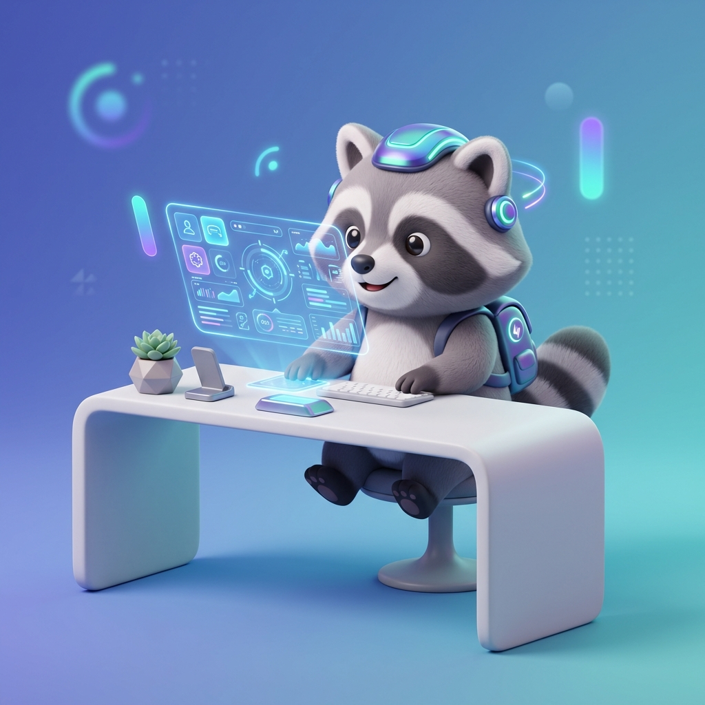

# Raccoon AI Assistant: 智能客服原型 (Prototype)

## 🌟 專案簡介
Raccoon AI Assistant 是一個專為一般消費者設計的智能客服聊天機器人原型。
本專案採用 **Vibe Coding** 開發模式，從初期單純的前端靜態切版，一路進化為結合 **Google Sheets Serverless API** 的動態應用。我們專注於提供流暢且具備情感連結的使用者體驗，徹底解決傳統機器人常見的「死胡同」痛點。

### 核心願景
> 「客服不應只是冷冰冰的問答，而是一個能主動引導並解決問題的智能助手。」

---

## ✨ 核心功能亮點 (Key Features)

### 1. ☁️ 無伺服器動態後端 (Serverless Architecture)
- **Google Sheets API**：將知識庫與 50+ 項商品目錄託管於 Google 表單，透過 Google Apps Script (GAS) 實現免部署即時更新。
- **本地降級保護 (Fallback)**：當雲端連線失敗時，自動切換至 `data/` 目錄下的本地 JSON 進行服務。

### 2. 🛍️ 電商體驗閉環 (E-commerce Flow)
- **智慧商品推薦**：支援依據情境動態過濾並展示商品卡片。
- **商品微彈窗 (Product Modal)**：點擊卡片查看大圖與詳細描述。
- **一鍵結帳模擬**：無縫串接從「選擇商品」到「確認訂單」的完整流程。

### 3. 🛡️ 易用性與防呆設計 (Usability-Driven)
- **智慧意圖引導 (3-Stage Discovery)**：當使用者輸入模糊時，AI 優先提供「猜測選項」按鈕，消滅對話死胡同。
- **動態真人轉接 (Dynamic Handover)**：
  - **被動觸發**：連續無法辨識意圖 2 次時，釋放最後的安全網。
  - **主動解析**：若雲端 FAQ 回覆文字內含「轉接真人」，自動渲染 UI 按鈕，確保無縫過渡。
- **語音輸入支援**：整合 Web Speech API，支援一鍵語音轉換文字。

### 4. 🎨 極致視覺信任 (Visual Trust Design)
- **現代化設計語言**：採用玻璃擬態 (Glassmorphism)、流暢的骨架屏 (Skeleton Loading) 與打字動畫。
- **深淺色模式 (Dark/Light Mode)**：支援手動切換並透過 LocalStorage 記憶使用者偏好。

---

## 📂 專案結構
- `index.html`: 主應用程式入口（包含 UI 結構與模態框）。
- `src/app.js`: 核心業務邏輯，包含 GAS API 串接、狀態管理與動態 UI 渲染。
- `static/`: 存放圖片、CSS 樣式表。
- `data/`: 本地備用 Mock 資料 (JSON)，作為雲端服務異常時的 Fallback。
- `docs/`: 存放產品規格書、開發者指南、實作紀錄與專案專用的標準作業流程 (`Skill.md`)。

---

## 🚀 如何啟動與測試 (Zero-Config)
1. 複製此專案至本地環境，或直接瀏覽 GitHub Pages。
2. 直接使用瀏覽器開啟根目錄下的 `index.html`，無需任何安裝步驟。

### 🧭 測試路徑建議
1. **探索階段**：使用底部的快捷按鈕，測試「運費資訊」或「訂單查詢」。
2. **購買階段**：輸入「我想買點東西」或「推薦禮物」，查看 50+ 商品庫的推薦卡片，並嘗試走完「結帳流程」。
3. **挫折階段 (測試引導邏輯)**：
   - 輸入「你是誰？」（觸發猜測問題）。
   - 測試動態轉接：輸入「笨」或「我要找真人」，觀察系統如何自動掛載轉接表單。

---

## 🔮 未來展望
- **擴展雲端功能 (Cloud Scaling)**：基於目前的 Google Sheets Serverless 架構，後續可進一步擴增不同工作表來管理活動檔期。
- **接入真 LLM (Gemini/GPT)**：搭配現有的意圖辨識，實現真正的自然語言長文理解與更複雜的推理。
- **多平台支援**：將目前的前端 UI 與後端邏輯部署整合至 LINE / WhatsApp / FB Messenger。
